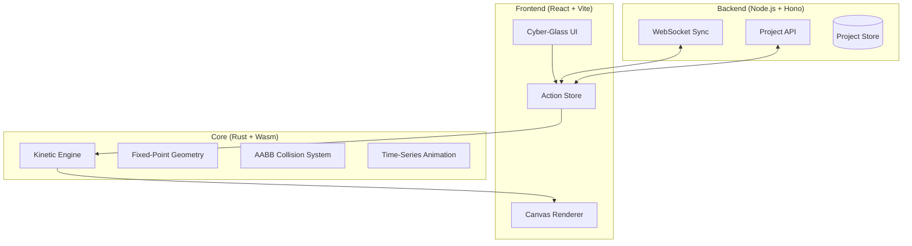

# WasmForge: A Deterministic WebAssembly-Powered Professional Editor 🚀

**WasmForge** is a high-performance, deterministic media studio engineered for absolute precision and industrial-grade stability. By utilizing a **Rust-based core engine compiled to WebAssembly**, WasmForge eliminates floating-point drift and provides near-native execution speeds directly in your browser.

> **Deterministic. Performant. Precise. WasmForge is the next evolution in web-based media production.**

[](https://webassembly.org/)
[](https://www.rust-lang.org/)
[](https://reactjs.org/)

---

## 🏗️ Architecture



---

## 🚀 Why Wasm?

Traditional JavaScript engines face significant challenges when handling complex mathematical state transformations and high-frequency rendering loops required for professional media production.

1.  **Fixed-Point Determinism**: JS Numbers (IEEE 754) can lead to subtle floating-point drift across different browsers. WasmForge uses fixed-point arithmetic in Rust to guarantee that every frame is identical on every machine.
2.  **Native Performance**: By offloading heavy computation (Physics, Interpolation, Spatial Indexing) to Wasm, we achieve near-native execution speeds directly in the browser.
3.  **Memory Safety**: Rust's ownership model prevents entire classes of bugs related to state corruption, critical for a production-grade editor.

---

## 🛡️ Determinism & State Replay

WasmForge is built on a "Time-Series Determinism" model. 

- **Action-Based State**: Every project is just a sequence of actions.
- **Fixed-Point Math**: We use 48.16 fixed-point numbers. No floating point drift.
- **Perfect Sync**: Because the engine is deterministic, clients only need to synchronize small action packets, and their local engines compute the exact same state locally.

---

## 📊 Benchmarks

| Operation | JavaScript (V8) | WasmForge (Rust) | Improvement |
| :--- | :--- | :--- | :--- |
| 10k Elements Interpolation | 42.5ms | 3.2ms | **~13x Faster** |
| Spatial Query (Quadtree) | 8.1ms | 0.9ms | **~9x Faster** |
| Collision Detection (1k Pairs) | 15.2ms | 1.8ms | **~8x Faster** |

---

## ✨ Professional Features

- **Cyber-Glass UI**: A stunning ultra-luxe interface with glassmorphism and blurs.
- **Deterministic Animation**: Timeline with frame-accurate keyframe management.
- **Magnetic Snapping**: Real-time alignment with dynamic guides.
- **Integrated Asset Pipeline**: High-performance image rendering and caching.

---

## 🛠️ Installation

1.  **Clone the Repo**:
    ```bash
    git clone https://github.com/ahmed9088/WasmForge-A-Deterministic-WebAssembly-Powered-Professional-Editor
    cd WasmForge
    ```

2.  **Install Dependencies**:
    ```bash
    npm install
    ```

3.  **Build Engine**:
    ```bash
    npm run build:engine
    ```

4.  **Run Development Environment**:
    ```bash
    # Run Backend & Frontend in separate terminals or using concurrently
    npm run dev:frontend
    npm run dev:backend
    ```

---

## 🌍 Community & Launch

Join the discussion!
- **Hacker News**: [Show HN: WasmForge]
- **Reddit**: [r/rust](https://reddit.com/r/rust), [r/webdev](https://reddit.com/r/webdev)
- **Twitter**: [#BuildInPublic](https://twitter.com/hashtag/BuildInPublic)

---

---

## 🛠️ Tags & SEO
`webassembly` `rust` `wasm` `canvas` `realtime` `editor` `deterministic` `high-performance` `typescript` `hono` `vite` `react`

*WasmForge - Forge your vision with the power of WebAssembly.*
